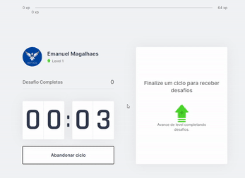

<h1 align="center">
    
</h1>


<p align="center">
  <a href="https://www.linkedin.com/in/emanuel-magalh%C3%A3es-aa3954b8/"></a>

</p>

<p align="center">
  <a href="#-sobre-o-projeto">Sobre o projeto</a>&nbsp;&nbsp;&nbsp;|&nbsp;&nbsp;&nbsp;
  <a href="#-tecnologias">Tecnologias</a>&nbsp;&nbsp;&nbsp;|&nbsp;&nbsp;&nbsp;
  <a href="#-iniciando">Iniciando</a>&nbsp;&nbsp;&nbsp;|&nbsp;&nbsp;&nbsp;
  <a href="#-como-contribuir">Como contribuir</a>&nbsp;&nbsp;&nbsp;|&nbsp;&nbsp;&nbsp;
  <a href="#-license">License</a>
</p>


<p align="center">
  
</p>

## 🧸 Sobre o projeto

 Move-it é um projeto desenvolvido durante a quarta edição da Next Level Week (Trilha ReactJs), evento organizado pela 🚀 [Rocketseat](https://rocketseat.com.br/).

A ideia do App é de ser uma forma divertida e saudavel de se manter produtivo nos estudos ou trabalho, associando uma série de mini desafios ao fim de períodos de 
25 minutos, simulando a tecnica de Pomodoro de produtividade ao mesmo tempo em que progride em uma barra de experiencia como nos nossos bons e velhos jogos de RPG.

## 🚀 Tecnologias

- [Node.js](https://nodejs.org/en/)
- [ReactJS](https://reactjs.org/)
- [TypeScript](https://www.typescriptlang.org/)
- [NextJS](https://nextjs.org/)

## 💻 Iniciando

Instale o Node.js em uma versao LTS, e dentro da pasta do projeto rode `npm dev run`

### Requirements

- [Node.js](https://nodejs.org/en/)
- [Yarn](https://classic.yarnpkg.com/)


```bash
$ git clone https://github.com/rayzen2002/moveit-nlw04.git && cd moveit-nlw04
```

**Siga os Passos a seguir**


### Web


```bash
# Iniciando pela pasta root do projeto 


# Instale as dependencias
$ yarn


$ yarn dev
```


## 🤔 Como contribuir

**Faça um fork deste repositório**

```bash
# Fork usando linha de comando oficial do GitHub 
# Se você nao tem a CLI, use o site para fazer isso.

$ gh repo fork rayzen2002/moveit-NLW04
```

**Siga os passos a seguir**

```bash
# Clone seu fork
$ git clone https://github.com/rayzen2002/moveit-nlw04.git && cd moveit-nlw04

# Crie uma branch com sua feature
$ git checkout -b my-feature

# Faça o commit com suas mudanças
$ git commit -m 'feat: My new feature'

# Mande o código para sua branch remota
$ git push origin my-feature
```

Após sua pull request ser merged, voce pode deletar sua branch

## 📝 License

This project is licensed under the MIT License - see the [LICENSE](LICENSE) file for details.

---

## Autor
Emanuel Magalhaes

[LinkedIn](https://www.linkedin.com/in/emanuel-magalh%C3%A3es-aa3954b8/)

Readme forked do Projeto de [Elias Gabriel](https://github.com/EliasGcf/nlw-3)

